# GlassBox

Counterfactual explainability platform for credit-risk decisions.

GlassBox combines:
- Fast prediction
- Counterfactual recourse generation
- Local/global interpretability
- Uncertainty, fairness, causal, robustness, privacy, and stability audits

The core goal is actionable transparency: not only "why this prediction happened", but "what can realistically change the outcome".

## Table Of Contents
- [System Overview](#system-overview)
- [Architecture](#architecture)
- [Repository Layout](#repository-layout)
- [Quickstart](#quickstart)
- [API Surface](#api-surface)
- [Model Pipeline](#model-pipeline)
- [Configuration](#configuration)
- [Testing And Validation](#testing-and-validation)
- [Troubleshooting](#troubleshooting)
- [Tech Stack](#tech-stack)

## System Overview
GlassBox is a full-stack application:
- `frontend/`: React + Vite dashboard with multi-tab analysis views
- `backend/`: FastAPI service exposing model inference and audit endpoints
- `backend/models/saved/`: persisted model and preprocessing artifacts

Primary interaction flow:
1. User enters a profile in the UI.
2. Backend predicts default risk using the EBM model.
3. Backend returns:
   - Prediction probabilities
   - Counterfactual recourse paths
   - Local feature importance
   - Conformal prediction sets
   - Recourse certification result
4. User explores what-if sliders and advanced audits.

## Architecture


## Repository Layout

```mermaid
flowchart TB
  ROOT["GlassBox/"]
  ROOT --> RD["README.md"]
  ROOT --> BE["backend/"]
  ROOT --> FE["frontend/"]

  BE --> BEA["app.py"]
  BE --> BES["schemas.py"]
  BE --> BER["requirements.txt"]
  BE --> BED["data/"]
  BE --> BEE["engine/"]
  BE --> BEM["models/"]
  BE --> BET["tests/"]

  BED --> BED1["download_dataset.py"]
  BED --> BED2["preprocess.py"]
  BED --> BED3["credit_default.csv"]

  BEE --> BEE1["counterfactual.py"]
  BEE --> BEE2["interpretability.py"]
  BEE --> BEE3["fairness.py"]
  BEE --> BEE4["causal_engine.py"]
  BEE --> BEE5["conformal_engine.py"]
  BEE --> BEE6["manifold_vae.py"]
  BEE --> BEE7["formal_verifier.py"]
  BEE --> BEE8["performative_audit.py"]
  BEE --> BEE9["privacy_engine.py"]
  BEE --> BEE10["robustness.py"]

  BEM --> BEM1["train_blackbox.py"]
  BEM --> BEM2["train_glassbox.py"]
  BEM --> BEM3["benchmark.py"]
  BEM --> BEM4["saved/"]

  BET --> BET1["test_regressions.py"]

  FE --> FE1["package.json"]
  FE --> FE2["vite.config.js"]
  FE --> FE3["index.html"]
  FE --> FE4["src/"]
  FE4 --> FE41["App.jsx"]
  FE4 --> FE42["api.js"]
  FE4 --> FE43["index.css"]
  FE4 --> FE44["components/"]
```


## Quickstart

### Prerequisites
- Python 3.10+ (3.11 recommended)
- Node.js 18+ and npm

### 1. Backend Setup
```bash
cd backend
python -m venv venv

# Windows
venv\Scripts\activate
# macOS/Linux
# source venv/bin/activate

pip install -r requirements.txt
```

### 2. Data And Model Artifacts
```bash
# Download dataset (or synthetic fallback) and preprocess
python -m data.download_dataset
python -m data.preprocess

# Train both models
python -m models.train_blackbox
python -m models.train_glassbox

# Optional benchmark report
python -m models.benchmark
```

### 3. Run Backend API
```bash
uvicorn app:app --host 0.0.0.0 --port 3100 --reload
```

### 4. Frontend Setup
```bash
cd ../frontend
npm install
npm run dev
```

Open `http://localhost:5173`.

## API Surface

Base URL: `http://localhost:3100`

| Method | Route | Purpose |
|---|---|---|
| `GET` | `/` | Service info and route list |
| `GET` | `/features` | Feature metadata for UI controls |
| `POST` | `/predict` | Prediction + conformal sets |
| `POST` | `/explain` | Prediction + counterfactuals + local importance + certification |
| `GET` | `/global-insights` | Global feature importance |
| `GET` | `/fairness` | Fairness audit summary |
| `GET` | `/causal-graph` | Causal graph nodes/edges |
| `POST` | `/manifold-projection` | Latent space projection for population + user |
| `GET` | `/stability-audit` | Strategic behavior / performative risk audit |
| `GET` | `/privacy-audit` | DP budget summary |
| `POST` | `/robustness-audit` | Local robustness metrics |

### Example: Explain Endpoint
```bash
curl -X POST "http://localhost:3100/explain" \
  -H "Content-Type: application/json" \
  -d '{
    "credit_limit": 50000,
    "sex": 2,
    "education": 2,
    "marriage": 1,
    "age": 35,
    "repayment_sep": 0,
    "repayment_aug": 0,
    "repayment_jul": -1,
    "repayment_jun": -1,
    "repayment_may": -1,
    "repayment_apr": -1,
    "bill_sep": 45000,
    "bill_aug": 42000,
    "bill_jul": 38000,
    "bill_jun": 35000,
    "bill_may": 30000,
    "bill_apr": 28000,
    "pay_sep": 2000,
    "pay_aug": 2000,
    "pay_jul": 1500,
    "pay_jun": 1500,
    "pay_may": 1000,
    "pay_apr": 1000
  }'
```

## Model Pipeline

### Preprocessing
Implemented in `backend/data/preprocess.py`:
- Loads and renames dataset columns
- Splits train/test with stratification
- Scales continuous features for DNN workflows
- Persists artifacts:
  - `scaler.pkl`
  - `feature_names.pkl`
  - `raw_splits.pkl`

### Training Scripts
- `backend/models/train_blackbox.py`: PyTorch DNN baseline
- `backend/models/train_glassbox.py`: Explainable Boosting Machine (EBM)
- `backend/models/benchmark.py`: side-by-side metrics

### Inference Notes
- Primary backend inference is driven by EBM on raw feature space.
- Counterfactual generation uses DiCE constraints over mutable features.
- Robustness and certification audits run local perturbation/constraint checks.

## Configuration

### Backend
- `GLASSBOX_ALLOWED_ORIGINS`
  - Comma-separated CORS origins.
  - If unset, defaults to localhost development origins.

### Frontend
- `VITE_API_BASE`
  - Optional API base URL override.
  - If unset, frontend resolves to current host with port `3100`.

Example:
```bash
# frontend/.env
VITE_API_BASE=http://localhost:3100
```

## Testing And Validation

### Backend Tests
```bash
cd backend
venv\Scripts\python -m pytest tests -q
```

### Frontend Build Check
```bash
cd frontend
npm run build
```

### Optional Quick API Smoke Test
```bash
curl http://localhost:3100/
```

## Troubleshooting

### `ModuleNotFoundError` when running backend scripts
- Run commands from the `backend/` directory.
- Ensure the virtual environment is activated.

### Frontend cannot reach API
- Verify backend is running on port `3100`.
- Set `VITE_API_BASE` if backend host/port differs.
- Check browser console/network tab for CORS or fetch errors.

### Missing model artifacts on startup
- Re-run:
  - `python -m data.preprocess`
  - `python -m models.train_glassbox`

### Long first-run latency
- SHAP, causal discovery, and VAE projection can take longer on initial load.
- Subsequent calls are faster after engine initialization and cached artifacts.

## Tech Stack

| Layer | Technology |
|---|---|
| API | FastAPI, Uvicorn |
| Frontend | React, Vite, D3 |
| Data/ML | Pandas, scikit-learn, PyTorch |
| Explainability | InterpretML (EBM), DiCE, SHAP |
| Governance/Audits | Fairlearn, Conformal methods, Z3, causal-learn, Opacus |
| Dataset | UCI Default of Credit Card Clients |
